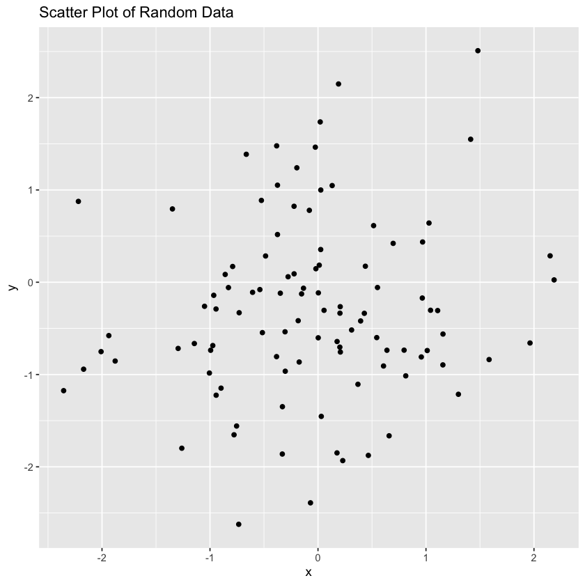

```r
# Install necessary packages if not already installed
if (!requireNamespace("IRkernel", quietly = TRUE)) {
  install.packages("IRkernel", repos = "http://cran.us.r-project.org")
  IRkernel::installspec()
}

if (!requireNamespace("ggplot2", quietly = TRUE)) {
  install.packages("ggplot2", repos = "http://cran.us.r-project.org")
}

if (!requireNamespace("dplyr", quietly = TRUE)) {
  install.packages("dplyr", repos = "http://cran.us.r-project.org")
}

# Load libraries with suppressed messages
suppressPackageStartupMessages(library(ggplot2))
suppressPackageStartupMessages(library(dplyr))

# Print a simple message
print("Hello, Jupyter!")

# Create a simple data frame
data <- data.frame(
  x = rnorm(100),
  y = rnorm(100)
)

# Display the first few rows of the data frame
head(data)

# Create a simple plot
ggplot(data, aes(x = x, y = y)) +
  geom_point() +
  ggtitle("Scatter Plot of Random Data")

# Perform a simple calculation
mean_x <- mean(data$x)
mean_y <- mean(data$y)

# Print the results
cat("Mean of x:", mean_x, "\n")
cat("Mean of y:", mean_y, "\n")
```
